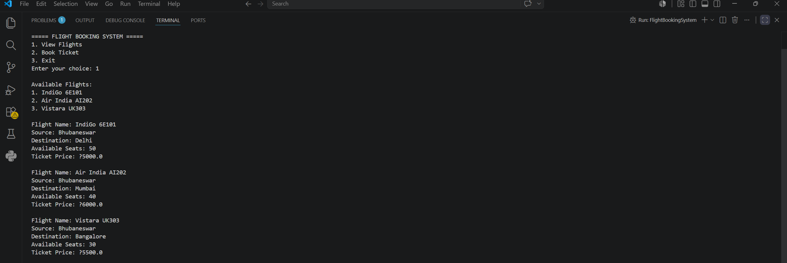
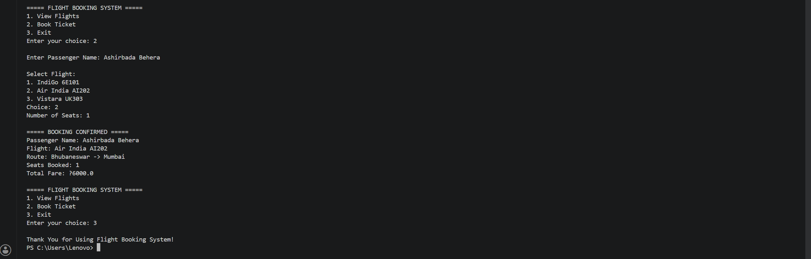

# ✈️ Flight Booking System

A simple Flight Booking System developed in Java using Object-Oriented Programming concepts. The system allows users to view available flights, book tickets, check seat availability, and calculate fares.

## Features

- View available flights
- Book flight tickets
- Check seat availability
- Automatic fare calculation
- Booking confirmation
- User-friendly console interface

## Technologies Used

- Java
- OOP Concepts
- Scanner Class

## How to Run

1. Clone the repository.
2. Open the project in any Java IDE.
3. Compile and run `FlightBookingSystem.java`.

## Output Screenshots

### View Flights

### Book Flight

## Author

**Ashirbada Behera**
